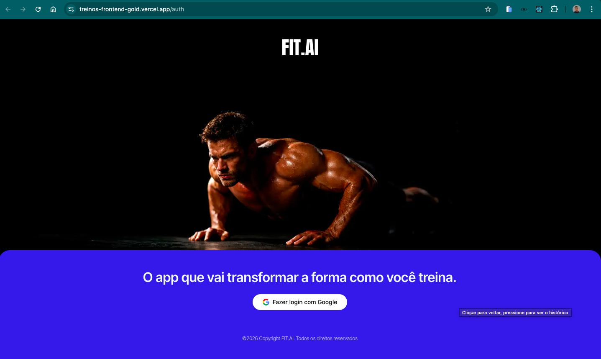
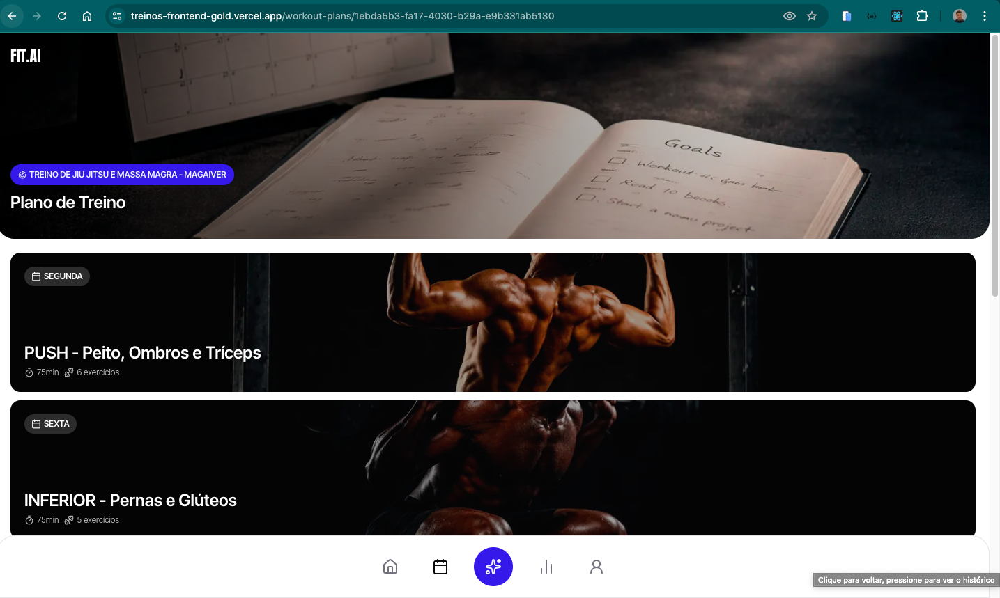
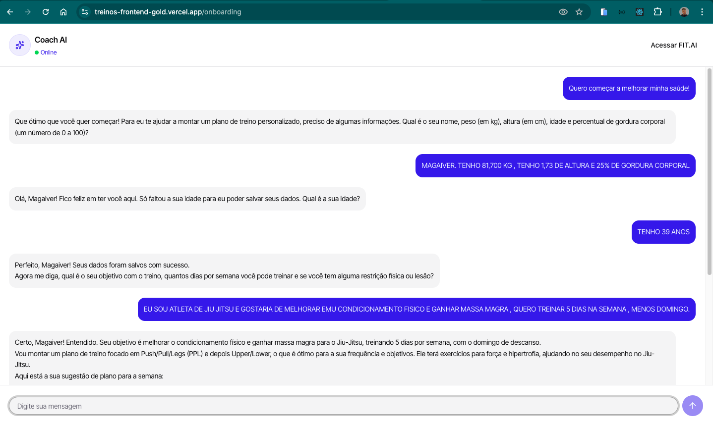
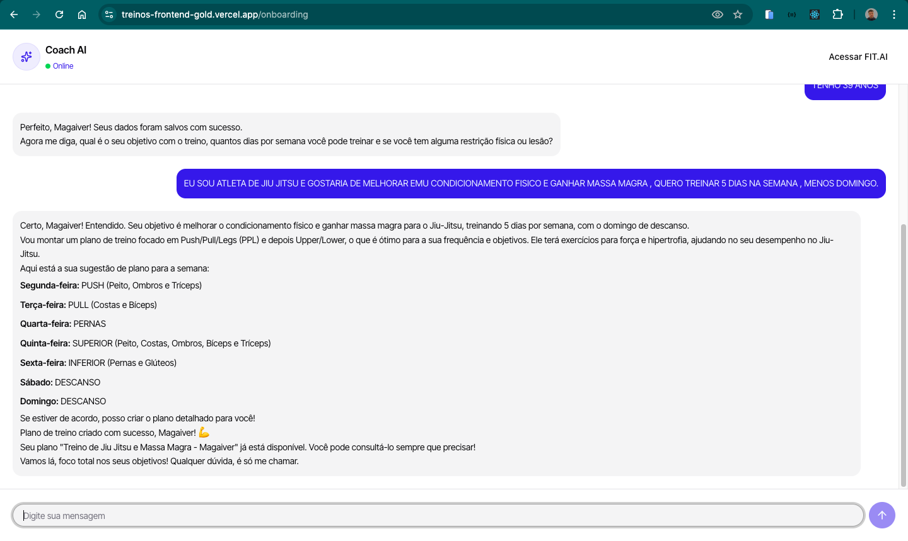

# FIT.AI — Treine com inteligência

Plataforma de gestão de treinos com inteligência artificial. O usuário conversa com um Coach AI personalizado que coleta seus dados, entende seus objetivos e cria um plano de treino completo e personalizado.



## Funcionalidades

- Autenticação com Google OAuth
- Onboarding conversacional com IA — o Coach AI coleta peso, altura, idade e objetivos via chat
- Geração automática de plano de treino personalizado com base no perfil do usuário
- Visualização do plano de treino com dias, exercícios, séries e tempo estimado
- Registro de sessões de treino
- Dashboard com streak de treinos e consistência semanal
- Chat com o Coach AI disponível em qualquer tela



## Stack

### Frontend (este repositório)
- **Next.js 16** com App Router
- **React 19**
- **Tailwind CSS v4**
- **Better Auth** — autenticação com Google OAuth
- **AI SDK** — streaming de respostas da IA via `useChat`
- **Orval** — geração automática de tipos e funções de API a partir do OpenAPI
- **React Hook Form + Zod** — formulários e validação
- **nuqs** — gerenciamento de estado na URL

### Backend ([repositório separado](https://github.com/seu-usuario/treinos-api))
- **Fastify** — framework HTTP
- **Prisma 7** com **Neon** (PostgreSQL serverless)
- **Better Auth** — sessões e OAuth
- **AI SDK + Google Gemini** — geração do plano de treino e chat do Coach AI
- **Zod** — validação de schemas
- **TypeScript**

## Arquitetura

O projeto tem frontend e backend separados, ambos deployados na Vercel. Para resolver o problema de cookies cross-origin entre os dois domínios, o frontend atua como proxy para as rotas de autenticação e IA — o browser se comunica sempre com o mesmo domínio e os cookies funcionam corretamente.

```
Browser
  └── treinos-frontend-gold.vercel.app
        ├── /api/auth/*  →  proxy  →  treinos-api.vercel.app/api/auth/*
        ├── /api/ai      →  proxy  →  treinos-api.vercel.app/ai
        └── demais rotas →  direto →  treinos-api.vercel.app/*
```



## Rodando localmente

### Pré-requisitos

- Node.js 22+
- pnpm
- Conta no Google Cloud com OAuth configurado
- Banco PostgreSQL (recomendado: [Neon](https://neon.tech))

### Frontend

```bash
# Clone o repositório
git clone https://github.com/seu-usuario/treinos-frontend
cd treinos-frontend

# Instale as dependências
pnpm install

# Configure as variáveis de ambiente
cp .env.example .env
```

Preencha o `.env`:

```env
NEXT_PUBLIC_API_URL=http://localhost:8081
NEXT_PUBLIC_BASE_URL=http://localhost:3000
```

```bash
# Rode o servidor de desenvolvimento
pnpm dev
```

Acesse [http://localhost:3000](http://localhost:3000).

### Backend

Veja as instruções completas no [repositório da API](https://github.com/seu-usuario/treinos-api).

```bash
git clone https://github.com/seu-usuario/treinos-api
cd treinos-api
pnpm install
```

Preencha o `.env` da API:

```env
PORT=8081
DATABASE_URL=postgresql://...
BETTER_AUTH_SECRET=sua-chave-secreta
API_BASE_URL=http://localhost:3000
WEB_APP_BASE_URL=http://localhost:3000
GOOGLE_CLIENT_ID=seu-client-id
GOOGLE_CLIENT_SECRET=seu-client-secret
GOOGLE_GENERATIVE_AI_API_KEY=sua-chave-gemini
NODE_ENV=development
```

```bash
pnpm dev
```



## Deploy na Vercel

O projeto usa dois projetos separados na Vercel — um para o frontend e um para o backend.

### Variáveis de ambiente — Frontend

| Variável | Valor |
|---|---|
| `NEXT_PUBLIC_API_URL` | URL do backend na Vercel |
| `NEXT_PUBLIC_BASE_URL` | URL do frontend na Vercel |

### Variáveis de ambiente — Backend

| Variável | Descrição |
|---|---|
| `DATABASE_URL` | Connection string do Neon |
| `BETTER_AUTH_SECRET` | Chave secreta para sessões |
| `API_BASE_URL` | URL do **frontend** na Vercel |
| `WEB_APP_BASE_URL` | URL do frontend na Vercel |
| `GOOGLE_CLIENT_ID` | Client ID do Google OAuth |
| `GOOGLE_CLIENT_SECRET` | Client Secret do Google OAuth |
| `GOOGLE_GENERATIVE_AI_API_KEY` | Chave da API do Google Gemini |
| `NODE_ENV` | `production` |

> **Importante:** `API_BASE_URL` no backend deve apontar para o domínio do **frontend**, não da API. Isso é necessário para que o Better Auth gere o callback URL correto no fluxo do Google OAuth.

### Google OAuth

No [Google Cloud Console](https://console.cloud.google.com), configure as URIs autorizadas:

**Origens JavaScript autorizadas:**
```
https://seu-frontend.vercel.app
https://sua-api.vercel.app
```

**URIs de redirecionamento autorizados:**
```
https://seu-frontend.vercel.app/api/auth/callback/google
https://sua-api.vercel.app/api/auth/callback/google
http://localhost:3000/api/auth/callback/google
```

## Licença

MIT
